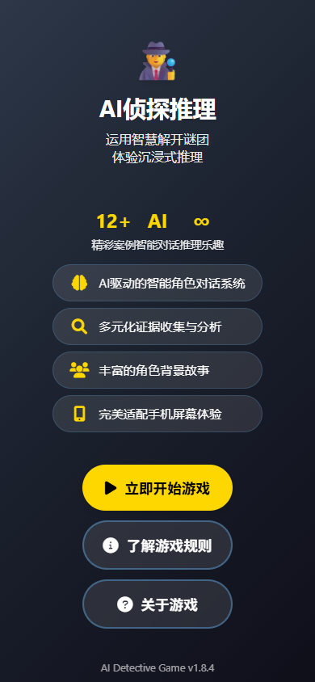

# 🕵️ AI侦探推理游戏 - Vibe Coding

<div align="center">

<table>
<tr>
<td align="center" width="30%">

<br><b>📱 移动端体验</b>
</td>
<td align="center" width="70%">

<br><b>🖥️ 桌面版体验</b>
</td>
</tr>
</table>

**🎮 Vibe Coding | 🧠 AI智能对话系统 | 📱 全平台支持**

</div>

> **🚀 开源AI游戏研究项目 | 欢迎加入我们的开发团队！**

这是一个AI驱动侦探推理游戏研究项目，我们正在探索人工智能在互动娱乐领域的无限可能。如果你对AI技术、游戏开发或推理逻辑感兴趣，我们诚挚邀请你加入我们的开发团队，一起创造下一代智能游戏体验！

> **💡 零代码开发**：整个项目完全使用 **Cursor** 开发完成，没有手写一行代码！这展示了AI辅助开发的强大潜力，证明了未来软件开发的新范式。

## ✨ 项目亮点

### 🧠 AI推理交互
- **深度AI对话系统**：每个角色都拥有独特的AI人格，能够进行复杂的推理对话
- **智能证据分析**：AI自动识别和关联证据，构建完整的推理链条
- **动态剧情生成**：根据玩家选择实时调整故事走向

### 🎨 多平台精美体验
- **💻 PC桌面版**：完整功能的桌面体验，支持复杂操作
- **📱 移动端适配**：专为手机优化的触控界面
- **🔧 管理后台**：强大的数据分析和管理功能
- **🎭 动态主题系统**：根据不同案件自动切换颜色主题和氛围
- **🌈 沉浸式视觉**：每个案件都有独特的视觉风格

### 📊 智能数据分析
- **🎯 用户行为分析**：深度追踪玩家游戏习惯和偏好
- **📈 游戏数据统计**：实时监控游戏进度、通关率、热门案件
- **🔍 推理路径分析**：分析玩家的推理思路和决策模式
- **📋 历史记录管理**：完整的游戏记录存储和回放功能
- **⚡ 性能监控**：系统性能指标和用户体验质量跟踪

### 🔮 未来发展方向
- **🤖 AI案件生成器**：计划支持AI自动创建新案件
- **📚 案件库扩展**：持续增加更多复杂有趣的推理案例
- **🌐 多语言支持**：面向全球用户的本地化体验
- **🎯 个性化推荐**：基于玩家偏好推荐适合的案件类型

### 🛠️ 技术特色
- **流式AI对话**：实时显示AI思考过程，增强沉浸感
- **模块化架构**：易于扩展和维护的现代化设计
- **数据分析后台**：完整的用户行为分析和游戏数据统计
- **Docker部署**：一键部署，支持多环境运行
- **规范化开发**：完整的开发规范体系，确保代码质量和一致性
- **主题系统**：统一的主题色彩管理，支持深色/浅色模式无缝切换
- **开源协作**：完全开源，欢迎社区贡献

## 📸 游戏截图

### 🖥️ 桌面版界面

<div align="center">

<table>
<tr>
<td align="center" width="50%">

</td>
<td align="center" width="50%">

</td>
</tr>
<tr>
<td align="center" width="50%">

</td>
<td align="center" width="50%">

</td>
</tr>
</table>

</div>

### 📱 移动端界面

<div align="center">

<table>
<tr>
<td align="center" width="50%">

</td>
<td align="center" width="50%">

</td>
</tr>
<tr>
<td align="center" width="50%">

</td>
<td align="center" width="50%">

</td>
</tr>
</table>

</div>

### 🔧 管理后台界面

<div align="center">

<table>
<tr>
<td align="center" width="50%">

</td>
<td align="center" width="50%">

</td>
</tr>
<tr>
<td align="center" width="50%">

</td>
<td align="center" width="50%">

</td>
</tr>
</table>

</div>


## 🚀 快速部署

### 环境要求

- Python 3.7+ 或 Docker
- OpenAI 兼容API密钥（必需）

### 方式一：直接运行（推荐）

```bash
# 1. 下载项目
git clone <repository-url>
cd ai-detective

# 2. 启动MySQL数据库容器
docker run --name mysql-container -d -p 3306:3306 -e MYSQL_PASSWORD=123456 mysql:5.7

# 3. 安装依赖
pip install -r requirements.txt

# 4. 设置API密钥
cp env.template .env
# 编辑 .env 文件，填入你的 OpenAI API 密钥和数据库配置

# 5. 初始化数据库表结构
python tools/setup_database.py

# 6. 启动游戏
python start_game.py

# 7. 打开浏览器访问 http://localhost:8000
```

### 方式二：Docker运行

```bash
# 1. 下载项目
git clone <repository-url>
cd ai-detective

# 2. 设置API密钥
cp env.template .env
# 编辑 .env 文件，填入你的 OpenAI API 密钥

# 3. 启动容器
cd docker
./deploy.sh          # Linux/macOS
# 或者 Windows 用户运行：deploy.bat

# 4. 打开浏览器访问 http://localhost:8000
```

## 🎯 游戏玩法

### 核心玩法

1. **选择案例**：从可用案例中选择一个开始调查
2. **角色对话**：点击角色头像与不同角色对话
3. **收集线索**：通过提问收集证据和信息
4. **分析推理**：根据收集的信息分析案件
5. **指控真凶**：当你确信找到真凶时进行指控
6. **审判环节**：观看AI角色的辩护和投票过程

## 🎨 前端特性

- **响应式设计**：支持桌面和移动设备
- **实时通信**：WebSocket支持实时游戏状态同步
- **流式输出**：AI回答实时显示，提升用户体验
- **现代UI**：渐变背景、卡片布局、平滑动画
- **智能主题**：自动适配深色/浅色模式，完整的主题色彩系统
- **自定义组件**：统一的UI组件库，完美的主题适配
- **角色切换**：独立的对话历史管理

## 🧠 AI系统

### 角色AI

每个角色都有独特的：
- 性格特征和背景故事
- 知识范围和秘密信息
- 行为模式和对话风格
- 动机和不在场证明

### 证据系统

- **智能揭露**：根据对话内容智能判断是否揭露证据
- **角色知识**：不同角色知道不同的证据信息
- **推理支持**：为玩家推理提供关键线索

### 指控系统

- **多角色参与**：所有角色参与辩护和投票
- **智能分析**：AI分析证据和对话历史
- **动态结果**：根据证据强度和角色立场决定结果

## 🛠️ 开发指南

### 📋 开发规范

在开始开发前，请务必阅读项目开发规范：

- **[开发规范总览](./rules/README.md)** - 完整的开发规范体系
- **[主题色规范](./rules/主题色规范.md)** - 前端主题色彩设计标准

### 环境搭建

#### Ubuntu环境启动游戏

```bash
python3 -m venv myenv       # 创建虚拟环境
source myenv/bin/activate  # 激活环境（Linux/macOS）
# Windows 使用 `myenv\Scripts\activate`
pip install -r requirements.txt
```

#### 调试模式

启用调试模式获取详细日志：

```bash
python start_game.py --debug
```

### 代码贡献指南

1. **遵循规范**：确保代码符合项目开发规范
2. **主题适配**：所有UI组件必须使用主题变量
3. **测试验证**：在深色和浅色主题下测试功能
4. **文档更新**：及时更新相关文档

### 添加新案例

1. 在 `backend/case_data.py` 中定义新案例
2. 包含角色、证据、时间线等完整信息
3. 测试角色对话和证据揭露逻辑

## 📝 配置说明

### 环境变量

| 变量名 | 说明 | 默认值 |
|--------|------|--------|
| `OPENAI_API_KEY` | OpenAI API密钥 | 必填 |
| `OPENAI_MODEL` | 使用的AI模型 | deepseek-v3 |
| `MAX_ROUNDS` | 最大对话轮数 | 30 |
| `MAX_HINTS` | 最大提示次数 | 3 |
| `HOST` | 服务器主机地址 | 0.0.0.0 |
| `PORT` | 服务器端口 | 8000 |

### 服务器配置

所有配置项都可以通过环境变量或 `env.template` 文件进行设置：

```bash
# 复制模板文件
cp env.template .env

# 编辑配置文件
# 必须设置 OPENAI_API_KEY
# 其他参数可根据需要调整
```

## 🔢 版本管理

### 版本号规则

- 格式：`主版本.次版本.修订版本` (例如: 1.6.0)
- 主版本：重大功能更新或架构变更
- 次版本：新功能添加
- 修订版本：Bug修复或小改进

### 版本管理操作

#### 查看当前版本
```bash
python update_version.py
```

#### 更新版本号
```bash
python update_version.py 1.7.0
```

## 🐛 故障排除

### 常见问题

1. **OpenAI API错误**
   - 检查API密钥是否正确
   - 确认账户有足够余额
   - 验证网络连接

2. **服务器启动失败**
   - 检查端口是否被占用
   - 确认Python版本兼容性
   - 查看错误日志详情

3. **前端显示异常**
   - 清除浏览器缓存
   - 检查控制台错误信息
   - 确认API服务正常运行

4. **数据库相关错误**
   - **表不存在错误**：运行 `python tools/setup_database.py` 创建数据库表
   - **数据库连接失败**：检查MySQL服务是否启动，确认连接配置正确
   - **权限错误**：确认数据库用户有足够的权限创建表和操作数据
   - **重新初始化数据库**：可以调用 `POST /api/database/init` API接口重新创建表结构

## 📄 许可证

本项目采用 MIT 许可证。详见 [LICENSE](LICENSE) 文件。

## 🤝 贡献

欢迎提交Issue和Pull Request来改进这个项目！

## 📞 联系方式

如有问题或建议，请通过以下方式联系：

- 提交 GitHub Issue
- 发送邮件至项目维护者

---

**享受推理的乐趣！🕵️‍♂️**